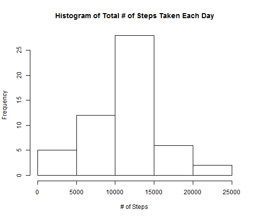
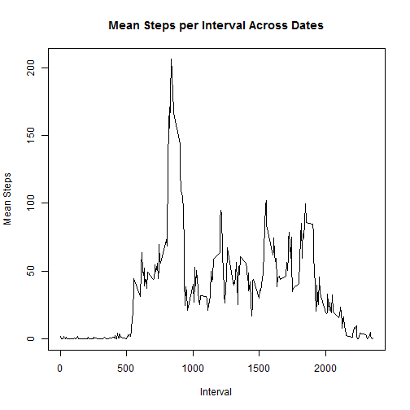
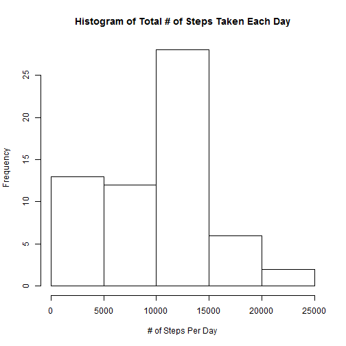
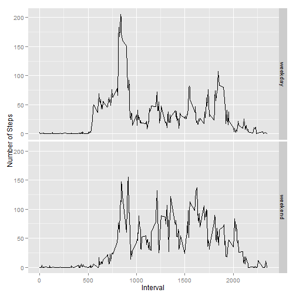

Reproducible Research - Project 1 - Amar Gupta
========================================================

The inital code sets up echoing and loads the source data.:


```r
opts_chunk$set(echo = TRUE)

sourcedata = read.csv("activity.csv", colClasses = c("integer", "Date", "integer"))
```


Part I: What is mean total number of steps taken per day?
--------------------------------------------------------

In this part, we'll examine the steps variable. First, a histogram that shows total steps taken each day. As the assignment says to, we ignore NA values by not using "na.rm = TRUE" when dcasting which would instead substitute 0 for the NA values and lead to an entirely different histogram.


```r
## Load the reshape2 library, then melt and recast
library(reshape2)
meltdata = melt(sourcedata, id.vars = c("date", "interval"))
firstcastdata = dcast(meltdata, date ~ variable, sum)

hist(firstcastdata$steps, 
     main = "Histogram of Total # of Steps Taken Each Day", 
     xlab = "# of Steps")
```

 

Now we report the mean and median number of total steps taken each day. Here, we have to add "na.rm = TRUE" if we want to avoid getting an NA for both outputs.


```r
mean(firstcastdata$steps, na.rm = TRUE)
```

```
## [1] 10766
```

```r
median(firstcastdata$steps, na.rm = TRUE)
```

```
## [1] 10765
```


Part II: What is the average daily activity pattern?
----------------------------------------------------

First, we make a time series plot of the average number of steps taken for each interval across all days. We use "na.rm = TRUE" when dcasting so that we can plot.


```r
## Data is already melted; recast based on interval and mean
secondcastdata = dcast(meltdata, interval ~ variable, mean, na.rm = TRUE)

plot(secondcastdata$interval, secondcastdata$steps,
     xlab = "Interval",
     ylab = "Mean Steps",
     main = "Mean Steps per Interval Across Dates",
     type = "l")
```

 

Then, we identify the interval that has the highest average number of steps:


```r
secondcastdata$interval[which.max(secondcastdata$steps)]
```

```
## [1] 835
```


Part III: Inputting missing values
-----------------------------------

First, we report the total number of missing values. There are only NA values in the "steps" variable, which makes sense because it's the only measured variable:


```r
sum(is.na(sourcedata$steps))
```

```
## [1] 2304
```

We will fill in the missing values using the median steps for that interval across all days:


```r
fillers = dcast(meltdata, interval ~ variable, median, na.rm = TRUE)
```

Now we integrate the filler values into the dataset. 


```r
completeddata = sourcedata

for (y in 1:length(completeddata$steps)) {
    
    if (is.na(completeddata[y, "steps"])) {
        
        intervalvalue = completeddata[y, "interval"]
        completeddata[y, "steps"] = fillers[fillers$interval == intervalvalue, "steps"]
    }
}
```

We can check that NA's have been eliminated by running summary on the updated data frame. 


```r
summary(completeddata)
```

```
##      steps          date               interval   
##  Min.   :  0   Min.   :2012-10-01   Min.   :   0  
##  1st Qu.:  0   1st Qu.:2012-10-16   1st Qu.: 589  
##  Median :  0   Median :2012-10-31   Median :1178  
##  Mean   : 33   Mean   :2012-10-31   Mean   :1178  
##  3rd Qu.:  8   3rd Qu.:2012-11-15   3rd Qu.:1766  
##  Max.   :806   Max.   :2012-11-30   Max.   :2355
```

Finally, we chart the results and report the mean and median. Note that this chart is different than the one we produced above because it now includes values for the eight days we had previously ignored. These days all added to the lowest bar in the histogram. 


```r
meltdata = melt(completeddata, id.vars = c("date", "interval"))
thirdcastdata = dcast(meltdata, date ~ variable, sum)

hist(thirdcastdata$steps, 
     main = "Histogram of Total # of Steps Taken Each Day", 
     xlab = "# of Steps Per Day")
```

 

The mean steps per day has decreased quite a bit. This follows from the histogram because it shows that the new days we introduced have step counts on the low-end.


```r
mean(thirdcastdata$steps)
```

```
## [1] 9504
```

The median steps per day only decreased slightly. This is caused by a change in the actual day that serves as the median; the addition of eight days on the low-end pulls the center of the data down by four slots.


```r
median(thirdcastdata$steps)
```

```
## [1] 10395
```

The code block below verifies our reasoning. In order, the columns show the date, the total steps in the source data, the total steps in the cleaned data and the difference between the two. This shows us that our cleaning of the NA values only affected step counts on eight days. Furthermore:

- The eight days affected went from 0 to 1,141, which would not move them out of the bottom grouping in the histogram.
- The eight days affected now have totals below the previous mean, which led to the new lower mean.
- All eight days affected now have totals below the previous median, which led to the new lower median.


```r
## This code combines the source and the completed data and tacks on a column showing the difference
df = merge(firstcastdata, thirdcastdata, by = "date")
df$difference = df$steps.y - df$steps.x
df[order(df[,3]),]
```

```
##          date steps.x steps.y difference
## 46 2012-11-15      41      41          0
## 2  2012-10-02     126     126          0
## 1  2012-10-01      NA    1141         NA
## 8  2012-10-08      NA    1141         NA
## 32 2012-11-01      NA    1141         NA
## 35 2012-11-04      NA    1141         NA
## 40 2012-11-09      NA    1141         NA
## 41 2012-11-10      NA    1141         NA
## 45 2012-11-14      NA    1141         NA
## 61 2012-11-30      NA    1141         NA
## 25 2012-10-25    2492    2492          0
## 39 2012-11-08    3219    3219          0
## 51 2012-11-20    4472    4472          0
## 29 2012-10-29    5018    5018          0
## 47 2012-11-16    5441    5441          0
## 26 2012-10-26    6778    6778          0
## 60 2012-11-29    7047    7047          0
## 44 2012-11-13    7336    7336          0
## 37 2012-11-06    8334    8334          0
## 24 2012-10-24    8355    8355          0
## 21 2012-10-21    8821    8821          0
## 50 2012-11-19    8841    8841          0
## 23 2012-10-23    8918    8918          0
## 30 2012-10-30    9819    9819          0
## 10 2012-10-10    9900    9900          0
## 18 2012-10-18   10056   10056          0
## 27 2012-10-27   10119   10119          0
## 15 2012-10-15   10139   10139          0
## 59 2012-11-28   10183   10183          0
## 11 2012-10-11   10304   10304          0
## 20 2012-10-20   10395   10395          0
## 36 2012-11-05   10439   10439          0
## 34 2012-11-03   10571   10571          0
## 33 2012-11-02   10600   10600          0
## 43 2012-11-12   10765   10765          0
## 7  2012-10-07   11015   11015          0
## 57 2012-11-26   11162   11162          0
## 3  2012-10-03   11352   11352          0
## 28 2012-10-28   11458   11458          0
## 19 2012-10-19   11829   11829          0
## 56 2012-11-25   11834   11834          0
## 4  2012-10-04   12116   12116          0
## 13 2012-10-13   12426   12426          0
## 42 2012-11-11   12608   12608          0
## 52 2012-11-21   12787   12787          0
## 9  2012-10-09   12811   12811          0
## 38 2012-11-07   12883   12883          0
## 5  2012-10-05   13294   13294          0
## 17 2012-10-17   13452   13452          0
## 22 2012-10-22   13460   13460          0
## 58 2012-11-27   13646   13646          0
## 48 2012-11-17   14339   14339          0
## 55 2012-11-24   14478   14478          0
## 16 2012-10-16   15084   15084          0
## 14 2012-10-14   15098   15098          0
## 49 2012-11-18   15110   15110          0
## 31 2012-10-31   15414   15414          0
## 6  2012-10-06   15420   15420          0
## 12 2012-10-12   17382   17382          0
## 53 2012-11-22   20427   20427          0
## 54 2012-11-23   21194   21194          0
```


Part IV: Are there differences in activity patterns between weekdays and weekends?
-----------------------------------------------------------------------------------

First, we create a new factor variable for our complete data frame that indicates whether the row's date is a "weekday" or a "weekend".


```r
## Extract weekdays, then convert to weekday or weekend
dow = weekdays(completeddata$date, abbreviate = FALSE)

for (y in 1:length(dow)) {
    if (dow[y] %in% c("Saturday", "Sunday"))
        dow[y] = "weekend"
    else
        dow[y] = "weekday"
}

## Finally, reassign to completeddata
completeddata$dayofweek = factor(dow)
```

Now we plot a summary of the results that shows the average number of steps taken per interval split between weekdays and weekends.


```r
## We have to melt the new completed data into averages by day of week and interval
meltdata = melt(completeddata, id.vars = c("date", "interval", "dayofweek"))
fourthcastdata = dcast(meltdata, dayofweek + interval ~ variable, mean)

## Now plot using the qplot function
library(ggplot2)
qplot(interval, steps, 
      data = fourthcastdata, 
      facets = dayofweek ~ .,
      xlab = "Interval",
      ylab = "Number of Steps",
      geom = "line")
```

 

